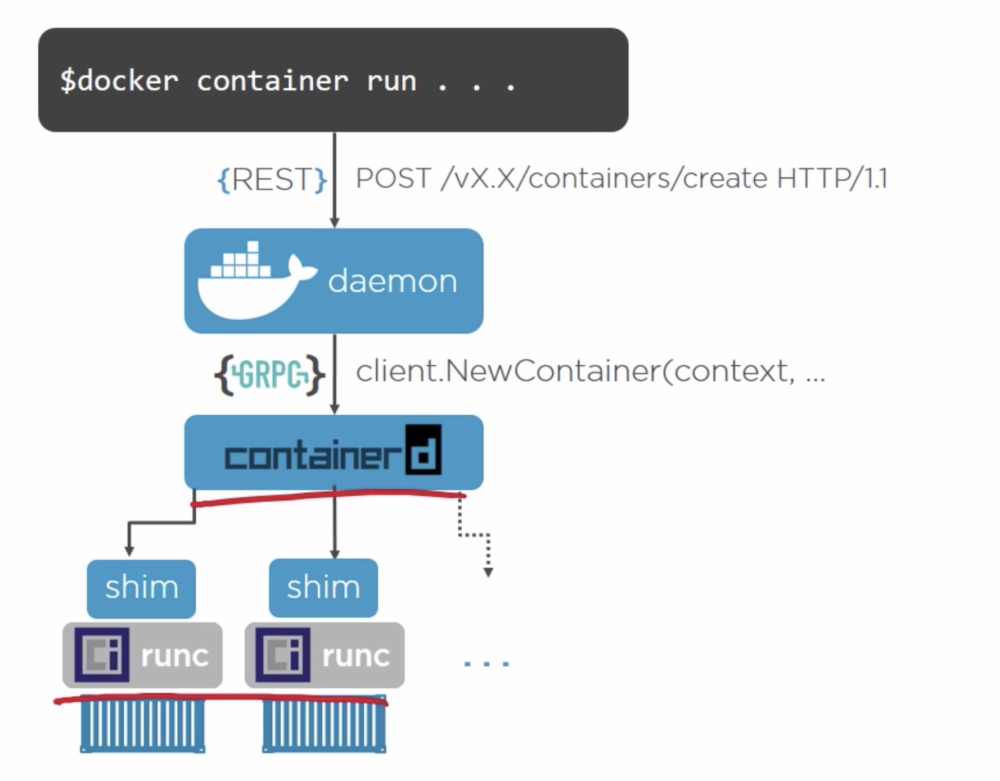

# Containers
https://opencontainers.org/




## Rancher Desktop
https://rancherdesktop.io/


Interface semelhante ao Docker Desktop, open source. Pode rodar tanto a CLI do docker quando to Containerd.

https://docs.rancherdesktop.io/faq

## Docker - Instalação
### Instalar WSL 2
Guias para instalação de Docker no Windows
https://learn.microsoft.com/pt-br/windows/wsl/install
  
### Instalação de uma Distro
Na instalação corrente foi utilizado o Ubuntu 22.04.2 LTS, no entanto esta instalação segue com problemas de iptables. Para solucionar este problema:
```
sudo update-alternatives --config iptables

```
Escolha a opção "iptables-legacy"
  

### Instalação do Docker
Pode-se seguir o padrão de instalação de docker para a distro escolhida, no caso, Ubuntu.
https://docs.docker.com/engine/install/ubuntu/


### Guia completo de instalação
https://educoutinho.com.br/windows/instalando-docker-no-wsl/#utilizar-iptables-legadas

